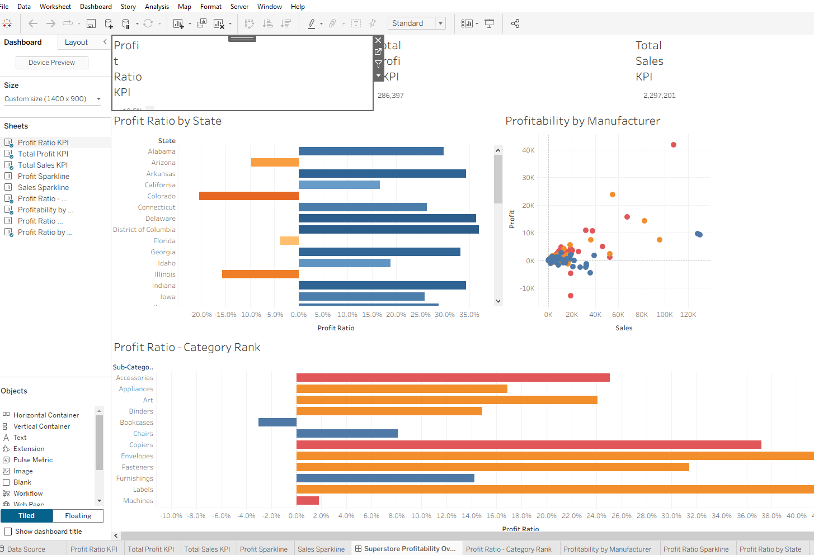

# tableau_python_creator

Programmatically generate Tableau workbooks (.twbx) from Python. No Tableau Desktop required for generation.



## What It Does

- Takes data (CSV, Excel, DataFrame) and chart specifications
- Generates valid Tableau workbook XML (TWB) and Hyper extracts
- Packages into .twbx files that open directly in Tableau Desktop

## Why

Tableau dashboard development is slow. This library lets you:

- **Prototype faster** — generate starter dashboards from code
- **Automate** — build dashboards programmatically from data pipelines
- **Integrate with AI** — expose as MCP tools for Claude to build dashboards from natural language

## Installation

```bash
pip install pandas pantab
```

## Project Structure

```
tableau_python_creator/
├── builders/
│   ├── __init__.py
│   ├── datasource_builder.py    # Column definitions, calculated fields, geo roles
│   ├── worksheet_builder.py     # Mark types, shelves, encodings
│   └── dashboard_builder.py     # Zone-based dashboard layouts
├── superstore_dashboard_generator.py  # Example: full Superstore dashboard
├── Sample - Superstore.csv            # Sample data
├── SKILLS_DOCUMENTATION.md            # Detailed patterns for reuse
└── README.md
```

## Quick Start

```python
from builders import DatasourceBuilder, CalculatedField, WorksheetBuilder, MarkType, Aggregation, DashboardBuilder

# 1. Define your datasource
ds = DatasourceBuilder('federated.abc123', 'MyData')
ds.add_column('Sales', 'real', 'measure', 'quantitative')
ds.add_column('Category', 'string', 'dimension', 'nominal')

# 2. Create a bar chart worksheet
ws = WorksheetBuilder('Sales by Category', 'federated.abc123')
ws.set_mark_type(MarkType.BAR)
ws.add_row_field('Category', 'dimension')
ws.add_col_field('Sales', 'measure', Aggregation.SUM)
ws.add_dependency_column('Category', 'string', 'dimension', 'nominal')
ws.add_dependency_column('Sales', 'real', 'measure', 'quantitative', aggregation='Sum')

# 3. Create a dashboard layout
db = DashboardBuilder('My Dashboard', width=1400, height=900)
root = db.add_container_zone(0, 0, 100000, 100000)
db.add_worksheet_zone('Sales by Category', 0, 0, 100000, 100000, parent_id=root)

# 4. Generate XML and package as .twbx
twb_xml = generate_twb_xml(ds, [ws], db)
```

See `superstore_dashboard_generator.py` for a complete working example.

## Supported Visualization Types

| Type | Mark | Description |
|------|------|-------------|
| Bar Chart | `MarkType.BAR` | Horizontal/vertical bars |
| Scatter Plot | `MarkType.CIRCLE` | Two measures with detail dimension |
| KPI / BAN | `MarkType.TEXT` | Big Ass Number — large centered value |
| Sparkline | `MarkType.AREA` | Minimal trend line over time |
| Line Chart | `MarkType.LINE` | Connected line chart |

## Key Concepts

### Calculated Fields

```python
profit_ratio = CalculatedField(
    caption='Profit Ratio',
    formula='SUM([Profit])/SUM([Sales])',
    datatype='real',
    role='measure',
    col_type='quantitative',
    default_format='p0.0%'
)
```

### Pre-aggregated Fields

Calculated fields with aggregation in the formula (e.g. `SUM([Profit])/SUM([Sales])`) must use `is_preaggregated=True`. This generates `derivation='User'` and `usr:` prefix in the XML, telling Tableau to evaluate the formula as-is.

```python
ws.add_col_field('Profit Ratio', 'measure', Aggregation.SUM,
                 is_calculated=True, calc_id=calc_id,
                 is_preaggregated=True)
```

### Dashboard Coordinates

Dashboards use a 100,000-unit coordinate system:
- `(0, 0)` = top-left
- `(100000, 100000)` = bottom-right
- Widths and heights are proportional to the total space

## Documentation

See [SKILLS_DOCUMENTATION.md](SKILLS_DOCUMENTATION.md) for detailed patterns covering every visualization type, field reference formats, and common pitfalls.

## Requirements

- Python 3.10+
- pandas
- pantab (for Hyper extract creation)
- Tableau Desktop (to open generated .twbx files)
